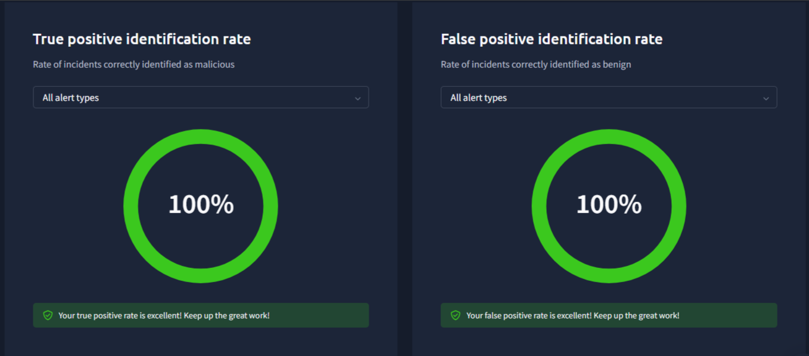
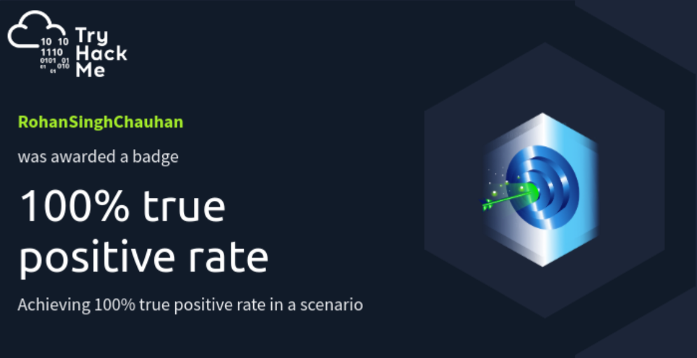

# Phishing Incident Analysis Report

A professional SOC investigation report based on TryHackMe's 
SOC Simulator — Introduction to Phishing scenario.

## About This Report

| Field | Details |
|-------|---------|
| **Platform** | TryHackMe SOC Simulator |
| **Scenario** | Introduction to Phishing |
| **SIEM** | Splunk |
| **Alerts Investigated** | 4 |
| **True Positives** | 3 |
| **False Positives** | 1 |

## What's Inside

- Multi-vector phishing campaign analysis
- Alert triage using Splunk SIEM
- IOC identification and documentation
- MITRE ATT&CK mapping
- Escalation of high-risk credential theft alert

## Tools Used
`Splunk` `Firewall Logs` `Alert Queue` `Analyst VM`

## Performance

**Scenario Score — 100% Completion:**

---

## Badges Earned

**First Alert Closed** — Successfully triaged and closed first SOC alert:

**First Scenario Completed** — Completed Introduction to Phishing:

**100% True Positive Rate** — Zero missed threats:

## Author
**Rohan Singh Chauhan**  
[TryHackMe Profile](https://tryhackme.com/p/RohanSinghChauhan) | 
[LinkedIn](https://www.linkedin.com/in/rohan-singh-chouhan-962434327)
